# Lali (Laravel Livewire) Starter Kit


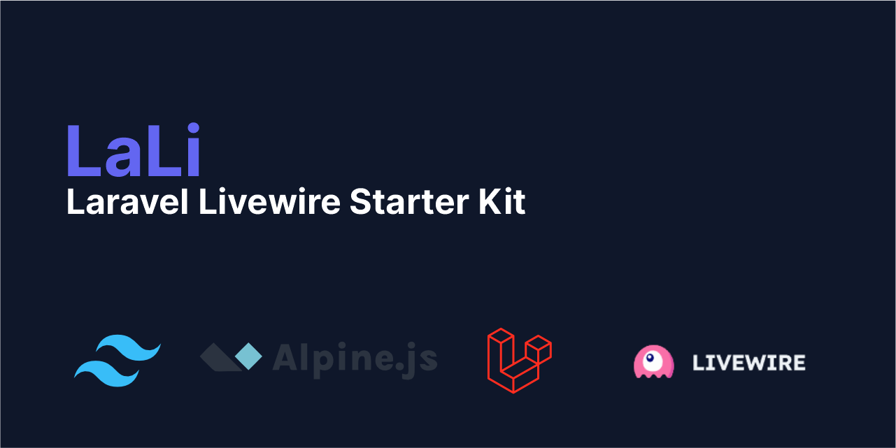

LaLi (Laravel Livewire) Starter Kit is a powerful foundation for building web applications with the TALL stack.

-   [TailwindCSS](https://tailwindcss.com/)
-   [AlpineJS](https://alpinejs.dev/)
-   [Laravel](https://laravel.com/)
-   [Livewire](https://livewire.laravel.com/)

Build with Livewire full page component and SPA (Single Page Application) with wire:navigate. It provides a feature-rich boilerplate to kickstart your project and accelerate your development process. Ready to go create your awesome project.

## Table of Contents

-   [Screenshots](#screenshots)
-   [System Requirements](#system-requirements)
-   [Built in Packages](#built-in-packages)
-   [Tailwind Plugin](#tailwind-plugin)
-   [Features](#features)
-   [Installation](#installation)
-   [License](#license)

## Screenshots (Dark Mode)

### Home Guest

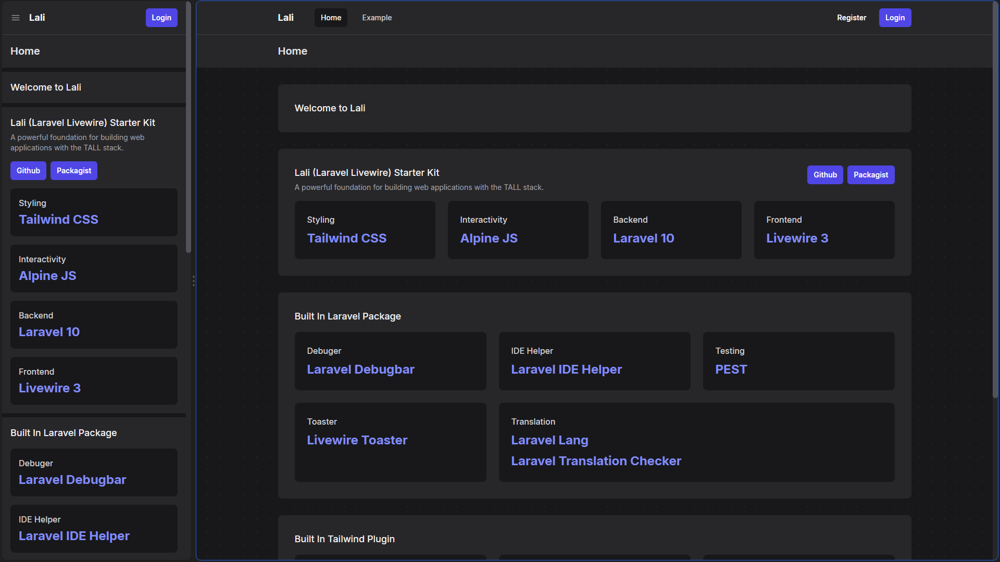

### Login

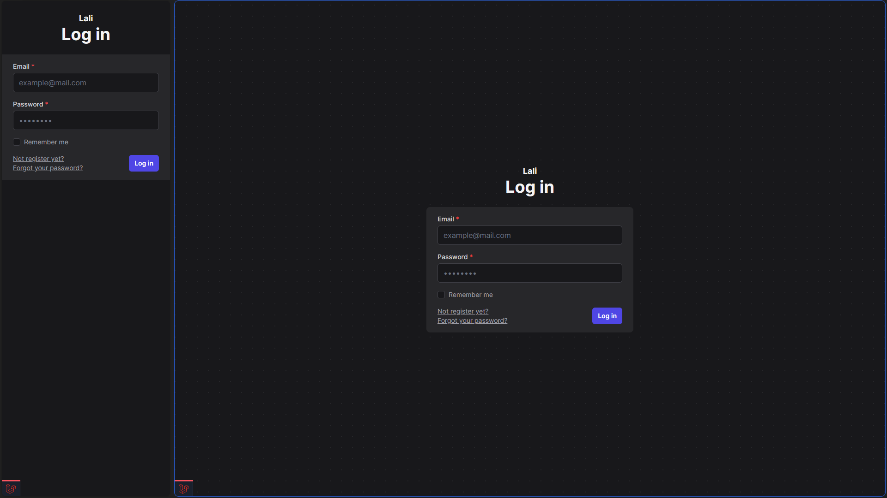

### Home Authenticated

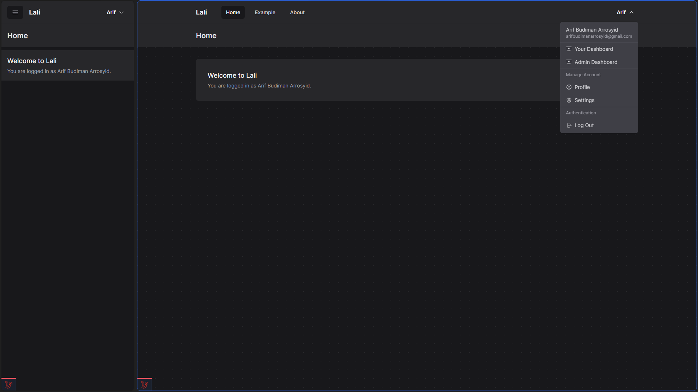

### User Dashboard

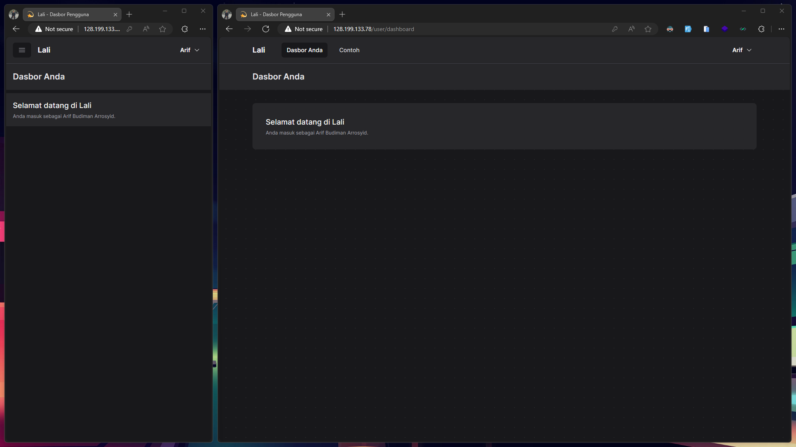

### User Profile

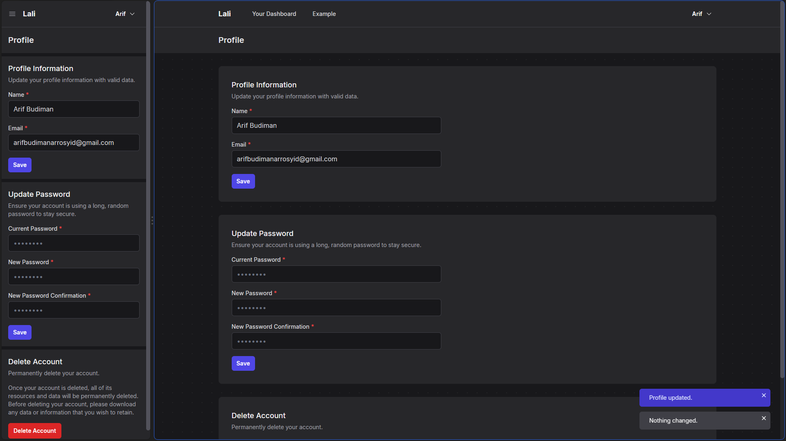

### Modal User Delete Account

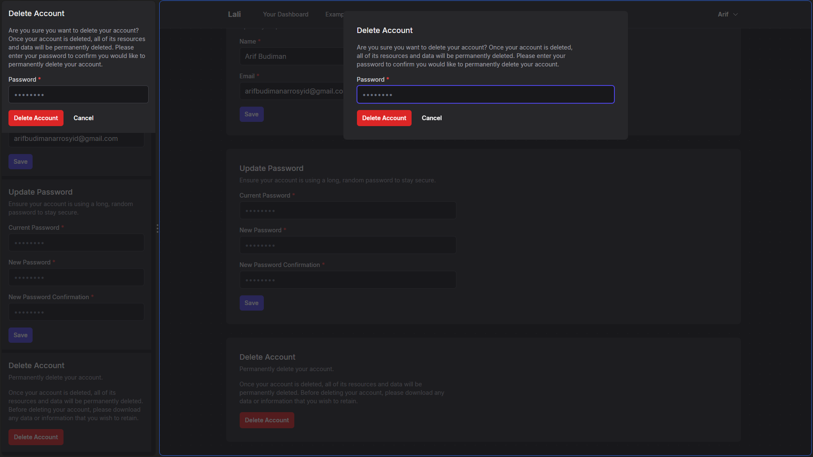

### User Settings

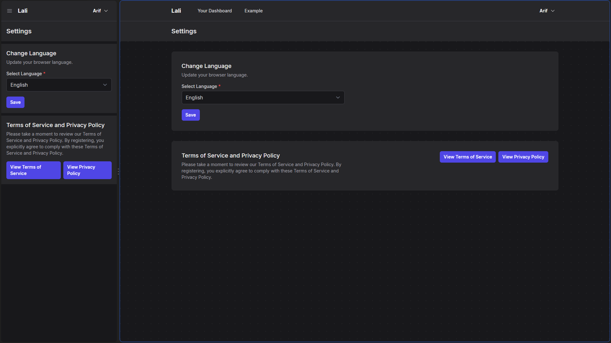

### Confirm Password

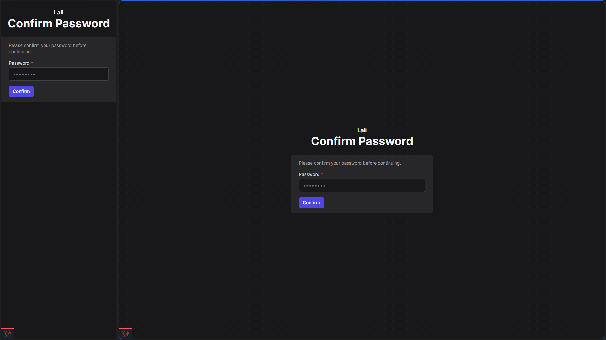

### Admin Dashboard

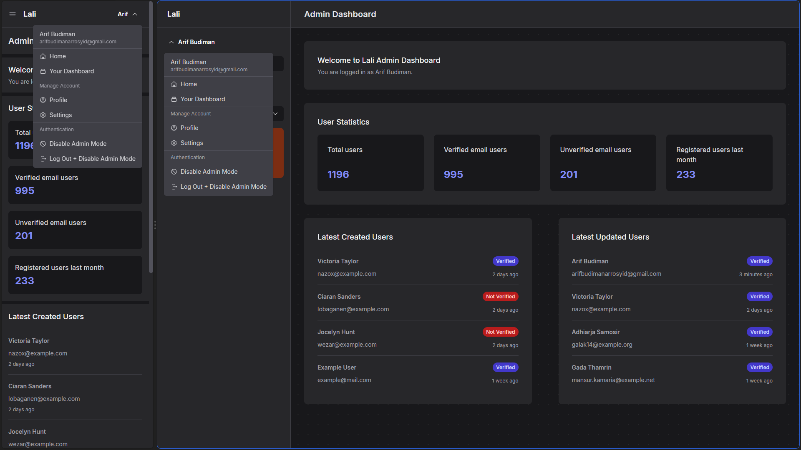

### Admin Users Index


### Admin Users Create

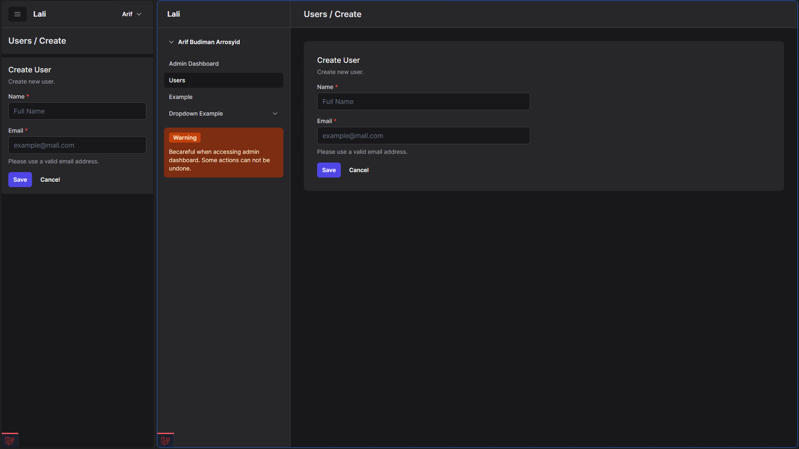

### Admin Users Show

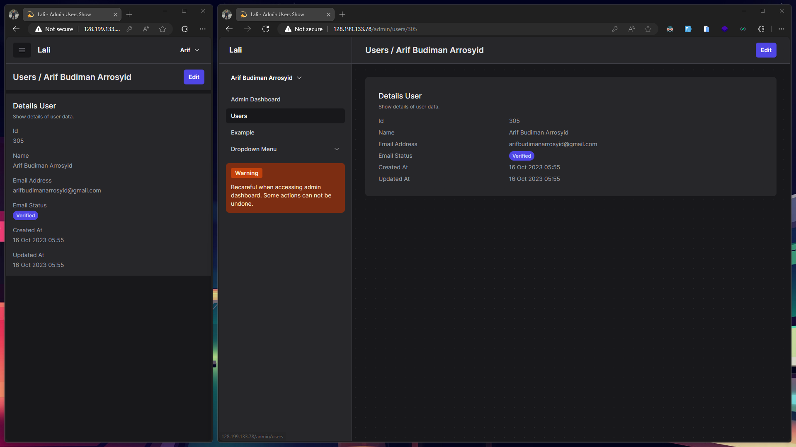

### Admin Users Edit

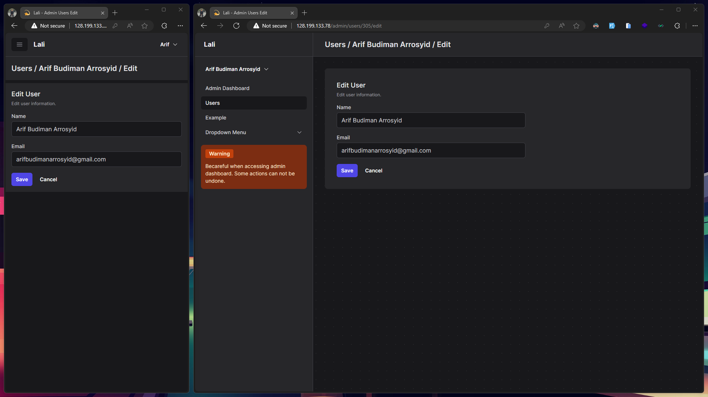

### Admin Users Delete

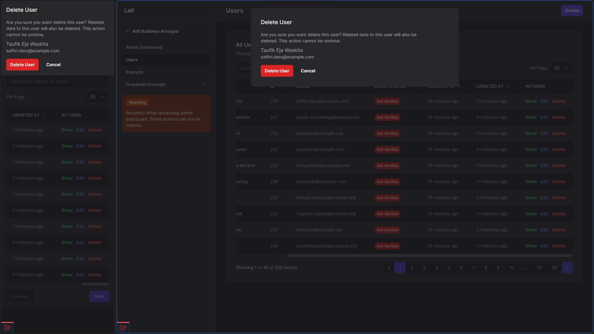

### Error 404

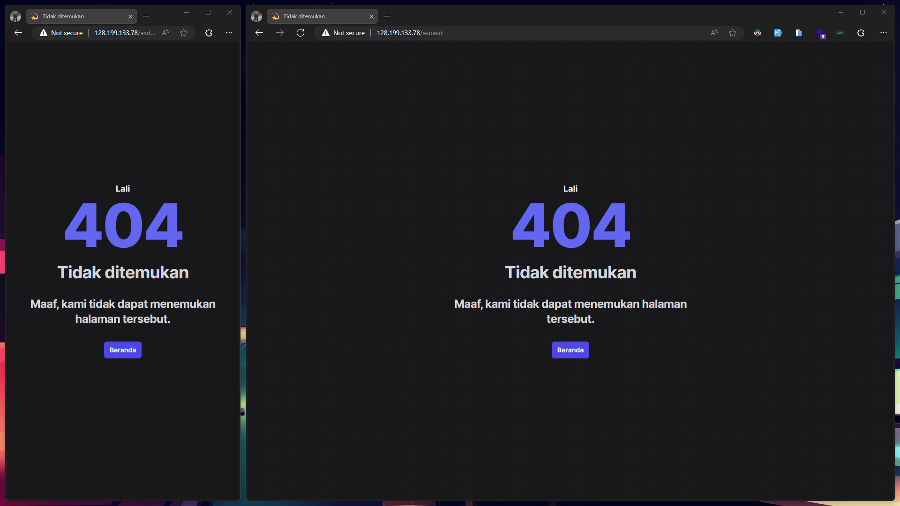

### Error 503


### Toaster

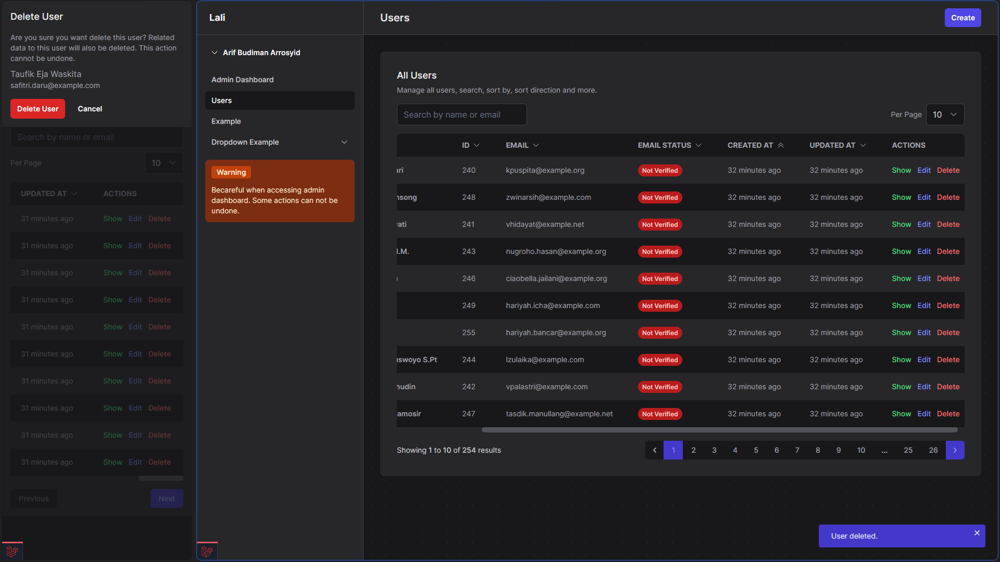

## System Requirements

-   PHP 8.1
-   Composer
-   NodeJS & NPM
-   MySQL

## Built in Packages

-   [Laravel Debugbar](https://github.com/barryvdh/laravel-debugbar)
-   [Laravel IDE Helper](https://github.com/barryvdh/laravel-ide-helper)
-   [Pest](https://pestphp.com/)
-   [Laravel Lang](https://github.com/Laravel-Lang/lang)
-   [Laravel Translation Checker](https://github.com/LarsWiegers/laravel-translations-checker)
-   [Livewire Toaster](https://github.com/masmerise/livewire-toaster)

## Tailwind Plugin

-   [Forms](https://github.com/tailwindlabs/tailwindcss-forms)
-   [Typography](https://tailwindcss.com/docs/typography-plugin)
-   [Dotted Background](https://github.com/hiimnit/tailwindcss-dotted-background)

## Features

LaLi comes packed with essential features and a well-structured codebase to get you started quickly:

-   Auth Layout
    -   [x] Register
    -   [x] Login
    -   [x] Logout
    -   [x] Verify Email
    -   [x] Password
        -   [x] Confirm Password
        -   [x] Request Password Reset
        -   [x] Reset Pasword
    -   [x] Terms of Service
    -   [x] Privacy Policy
-   Main Layout
    -   [x] Home
    -   [x] Example
    -   [x] About
-   App Layout
    -   [x] Dashboard
    -   [x] Profile
        -   [x] Update Profile Information
        -   [x] Update Password
        -   [x] Delete Account
    -   [x] Settings
        -   [x] Language
        -   [x] Terms of Service and Privacy Policy
    -   [x] Example
-   Admin Layout
    -   [x] Dashboard
        -   [x] Total users
        -   [x] Verified email users
        -   [x] Unverified email users
        -   [x] Registered users last month
        -   [x] Latest Created Users
        -   [x] Latest Updated Users
    -   [x] Users
        -   [x] Create
        -   [x] Index
            -   [x] Delete
            -   [x] Search
            -   [x] Sort By
            -   [x] Sort Direction
            -   [x] Per Page
            -   [ ] Filter (Not implemented yet, only commented html code)
            -   [ ] Bulk Delete (Not implemented yet, only commented html code)
            -   Pagination
                -   [x] Custom Pagination
                -   [x] Custom Simple Pagination
        -   [x] Show
        -   [x] Edit
    -   [x] Example
-   Custom Error Page
    -   [x] 401
    -   [x] 402
    -   [x] 403
    -   [x] 404
    -   [x] 419
    -   [x] 429
    -   [x] 500
    -   [x] 503
-   Tested with Pest
    -   [x] Feature Test (194 assertions)
-   Livewire
    -   SPA (Single Page Application) with wire:navigate
    -   Full Page Livewire Component
    -   Toaster Notification
    -   4 Layouts
        -   [x] Auth Layout
        -   [x] Main Layout
        -   [x] App Layout (default)
        -   [x] Admin Layout
-   Theme Auto by System Preferences with TailwindCSS
    -   [x] Dark Mode
    -   [x] Light Mode
-   Languages
    -   [x] English (default)
    -   [x] Indonesian

## Installation

### Via Composer

1. Create a new project
    ```
    composer create-project arifbudimanar/lali
    ```
2. Run NPM Install
    ```
    npm install
    ```
3. Ready to use
    ```
    php artisan serve
    ```

### Via Git Clone

1. Clone this repository
    ```
    git clone https://github.com/arifbudimanar/lali.git
    ```
2. Run Composer Install
    ```
    composer install
    ```
3. Run NPM Install
    ```
    npm install
    ```
4. Copy .env.example to .env
    ```
    cp .env.example .env
    ```
5. Run NPM Dev
    ```
    npm run dev
    ```
6. Run Migration and Seeding
    ```
    php artisan migrate
    php artisan db:seed
    php artisan db:seed UserSeeder
    ```
7. Run the server (Optional)
    ```
    php artisan serve
    ```
8. Open the browser and go to http://localhost:8000 or http://lali.test

## License

LaLi is open-source software licensed under the [MIT License](https://github.com/arifbudimanar/lali/blob/main/LICENSE). Feel free to use it in your projects, and we appreciate any contributions or feedback you might have.
